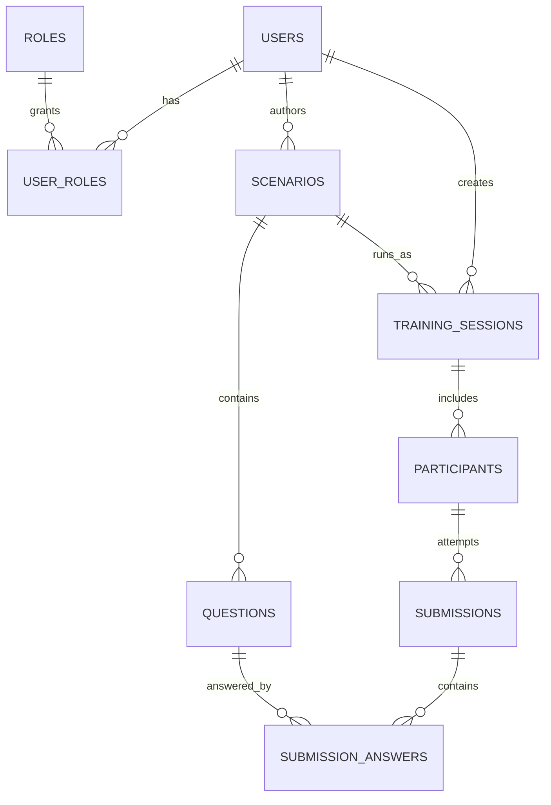

# Gate B: Conceptual ERD (v1)

This document defines the conceptual entity relationships for v1.
It is intentionally DB-agnostic and focuses on cardinality and data ownership.

## Entities
- `users`: platform accounts (instructor/admin/other internal roles).
- `roles`: role definitions.
- `user_roles`: join table mapping users to roles.
- `scenarios`: training scenario definitions.
- `questions`: prompts that belong to one scenario.
- `training_sessions`: runnable session instance tied to one scenario.
- `participants`: people inside a training session (named or anonymous).
- `submissions`: one participant attempt in a session.
- `submission_answers`: per-question answer rows under a submission.

## Relationship Cardinality
1. `users` to `user_roles`: `1:N`
2. `roles` to `user_roles`: `1:N`
3. `users` to `scenarios` (creator): `1:N` (optional in v1 if creator tracking is deferred)
4. `users` to `training_sessions` (creator/instructor): `1:N`
5. `scenarios` to `questions`: `1:N`
6. `scenarios` to `training_sessions`: `1:N`
7. `training_sessions` to `participants`: `1:N`
8. `participants` to `submissions`: `1:N` (multiple submissions allowed)
9. `submissions` to `submission_answers`: `1:N`
10. `questions` to `submission_answers`: `1:N`

## Conceptual Constraints
- A `question` must belong to exactly one `scenario`.
- A `training_session` must reference exactly one `scenario`.
- A `participant` must belong to exactly one `training_session`.
- A `submission` must belong to exactly one `participant`.
- A `submission_answer` must belong to exactly one `submission` and one `question`.
- `participants` may be anonymous, so participant identity fields can be nullable or represented by an anonymous flag.
- Multiple submissions are allowed per participant, so no uniqueness constraint on `(participant_id)` alone.
- Questions are locked after first submission in v1 (enforced at application layer; schema versioning deferred).
- Roles are table-backed (`roles` + `user_roles`) rather than enum-only.

## Join Paths Needed By Core Flows
1. Review all answers in a session:
`training_sessions -> participants -> submissions -> submission_answers -> questions`
2. Show all sessions for a scenario:
`scenarios -> training_sessions`
3. Show all questions for scenario delivery:
`scenarios -> questions`
4. Resolve user permissions:
`users -> user_roles -> roles`

## Mermaid ER Diagram

## Notes Before Gate C
- Gate C will convert this conceptual model into concrete columns, PK/FK definitions, uniqueness rules, and index choices.
- Any change to cardinality here should be treated as a scope decision and recorded explicitly.
